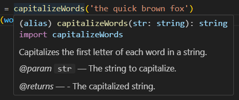

# str-text-utils

str-text-utils is a utility library for string manipulation, providing a set of functions to simplify common string operations such as converting to camelCase, capitalizing words, counting characters, checking for palindromes, reversing strings, and trimming whitespace.

## 🛠️ Installation

Install str-text-utils via npm:

```pre
npm install str-text-utils
```

## ⭐ Usage

Import the functions you need from str-text-utils:

| Name        | Usage           | Output  |
| :------------- |:-------------| :-----|
| Capitalize Words      | capitalizeWords('the quick brown fox') | The Quick Brown Fox |
| Camel Case      | toCamelCase('quick brown fox')      | quickBrownFox |
| Trim Spaces | trimSpaces('   leading and trailing spaces   ')      |  leading and trailing spaces |
| Word Count | wordCount('count the number of words') | 5 |
| Reverse String | reverseString('desserts') | stressed |
| Palindrone | isPalindrome('A man a plan a canal Panama') | true |
| Dot Case | toDotCase('dot case example') | dot.case.example |
| Sentence Case | toSentenceCase('this is a sentence. another one here!') | This is a sentence. Another one here! |
| Snake Case | toSnakeCase('Snake Case Example') | snake_case_example |


## 🚀 Contributing

Contributions are welcome! Please feel free to submit a Pull Request.

## ✨ Documentation in VS Code

When using this package in Visual Studio Code, you can get more information about each method by hovering over it. 



## 📃 LICENSE

This package in under [MIT License](https://github.com/jatiinyadav/string-utils/blob/master/LICENSE).
